# infracity


## Dev

```
virtualenv env -p `command -v python3`
source env/bin/activate
pip install -r requirements.txt
python main.py
```


## Javascript ISOmetric engines

* Traviso - https://www.travisojs.com - https://github.com/axaq/traviso.js
* JSiso - https://jsiso.com - https://github.com/beakable/isometric
* Isogenic Game Engine - https://www.isogenicengine.com - https://github.com/irrelon/ige
* ????


## Sprite Sheets

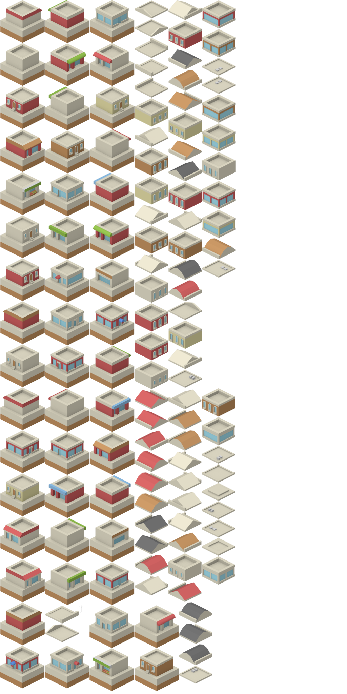
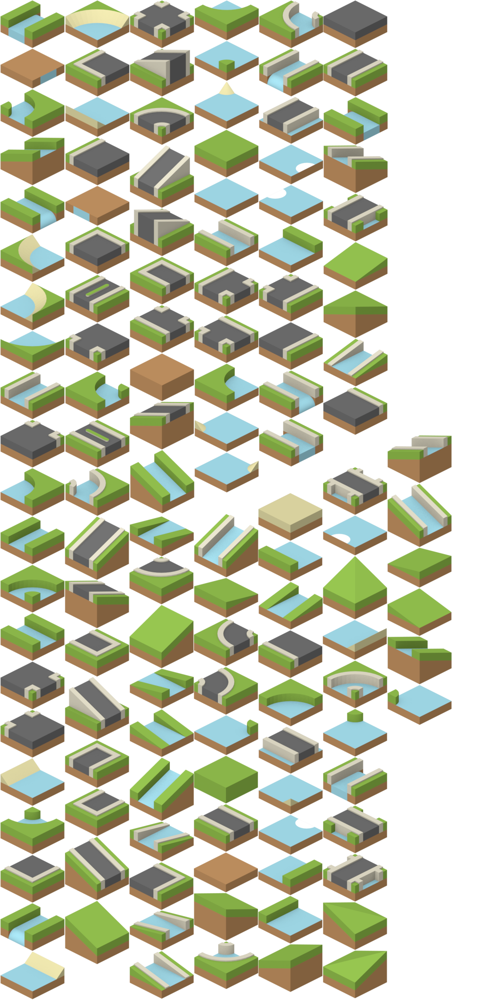
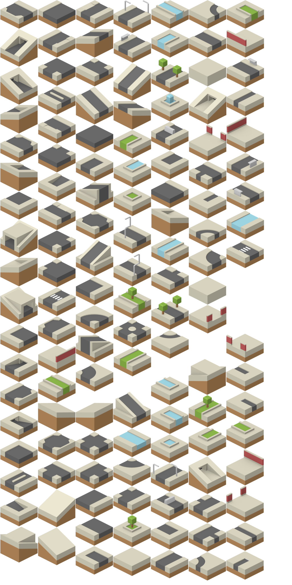
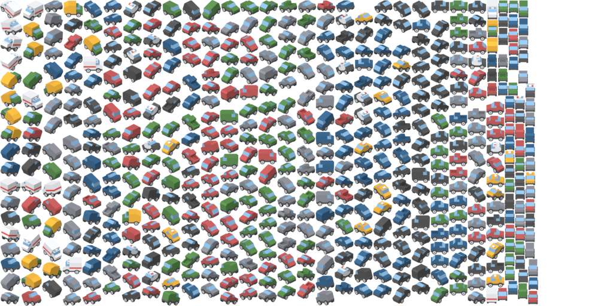
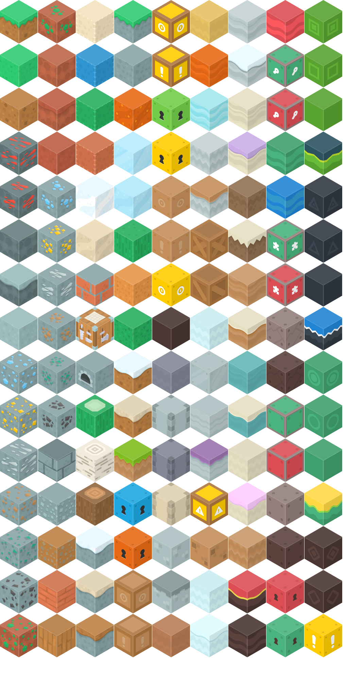

## Kubernetes

* Cluster
  - Archipelago
* Node
  - Island
  - Object Color ?
* Namespace
  - Object Color ?
  - Island
  - Town ?
* Pod
  - Building 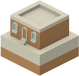
  - One floor per Container 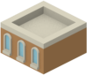
* Deployment
  - District
  - Building with red color
* ReplicatSet
  - District
  - Building with red color
* StateFulSet
  - District
  - Building with green color
* DaemonSet
  - District
  - Building with blue color
* Service
* Ingress
* Cronjob
* ConfigMap
* Secret
  - Garage ?
* Service account
* PVC
* PV
* Role
* ClusterRole
* RoleBinding
* ClusterRoleBinding

## Azure

* Subscription
  - Archipelago
* Region
  - Island 
* Resource group
  - Town
* Microsoft.Compute/disks
* Microsoft.Compute/virtualMachines
  - Building 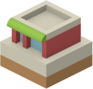
* Microsoft.Compute/virtualMachineScaleSets
  - Building 
  - One floor per VM 
* Microsoft.ContainerService/managedClusters
* Microsoft.DBforPostgreSQL/servers
* Microsoft.ManagedIdentity/userAssignedIdentities
* Microsoft.Network/loadBalancers
  - Road crow's foot
* Microsoft.Network/networkInterfaces
  - Garage under the building 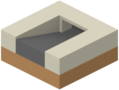
* Microsoft.Network/networkSecurityGroups
* Microsoft.Network/networkWatchers
* Microsoft.Network/privateDnsZones
* Microsoft.Network/privateDnsZones/virtualNetworkLinks
* Microsoft.Network/privateEndpoints
  - Tunnel entrance 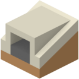
* Microsoft.Network/publicIPAddresses
* Microsoft.Network/routeTables
  - Round about 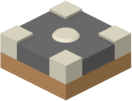
* Microsoft.Network/virtualNetworks
* Microsoft.OperationalInsights/workspaces
* Microsoft.OperationsManagement/solutions
* Microsoft.Storage/storageAccounts


## Links

### Tiles

From Kenney (https://opengameart.org/users/kenney)
* https://opengameart.org/content/isometric-blocks
* https://opengameart.org/content/isometric-vehicles-1
* https://opengameart.org/content/isometric-city


From Eracoon (https://opengameart.org/users/eracoon)
* https://opengameart.org/content/isometric-vehicles
* https://opengameart.org/content/isometric-vehicles-2
* https://opengameart.org/content/isometric-vehicles-3
